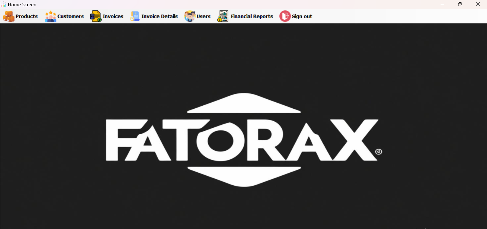
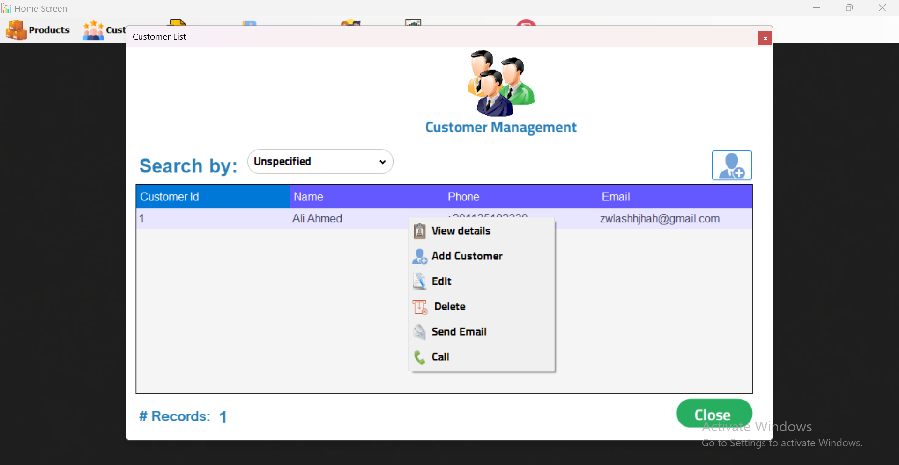
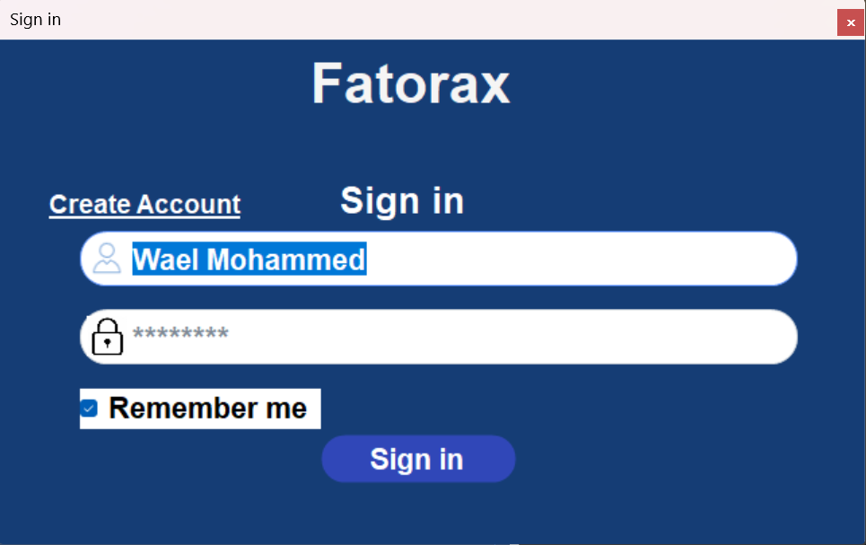
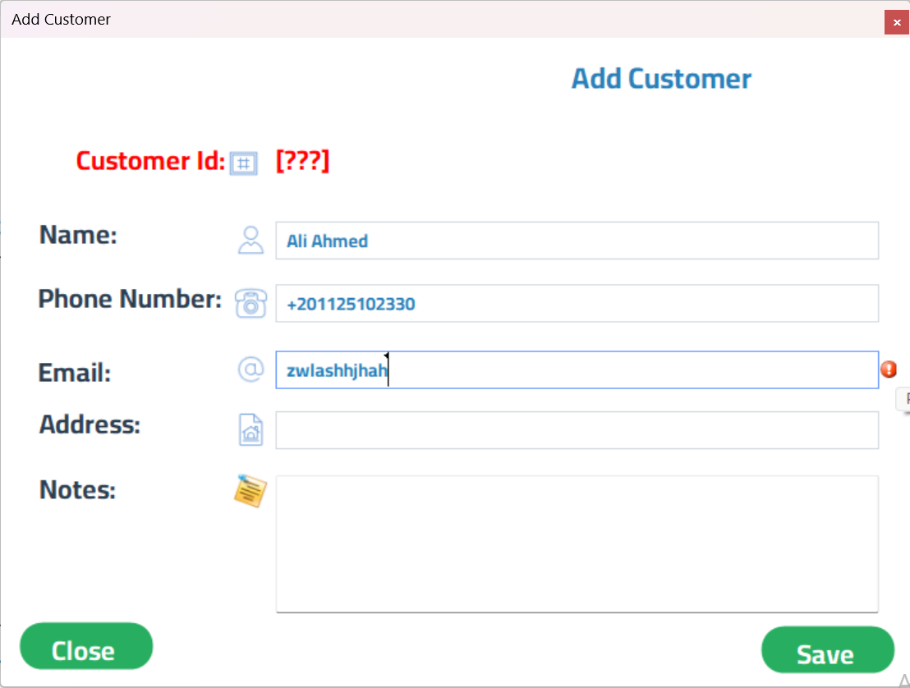
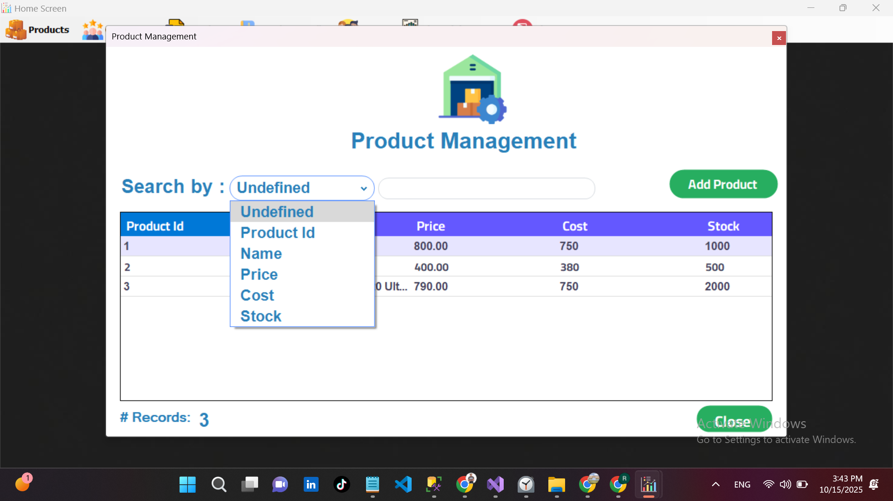
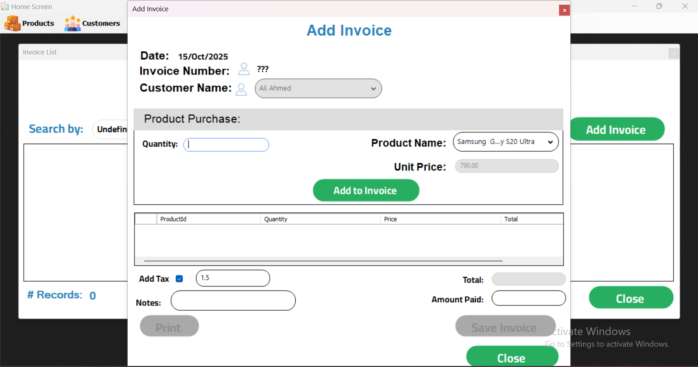
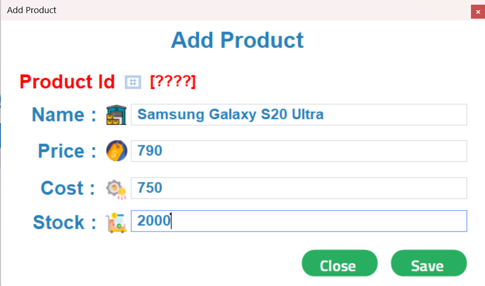
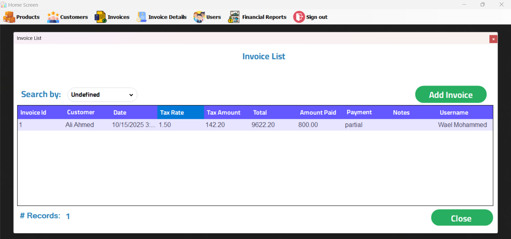
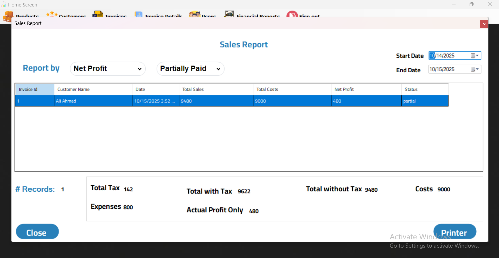
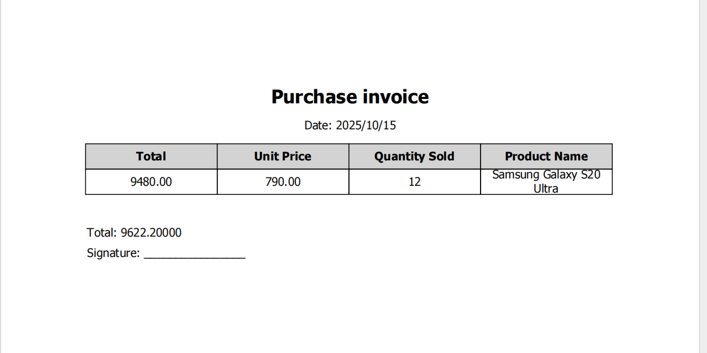

# 💼 FatoraX - Invoicing & Business Management System



FatoraX is a comprehensive, **offline-first** desktop application designed to provide a robust solution for sales and invoice management.
Developed as a **lifetime-license product**, it targets small to medium businesses needing an effective tool without recurring subscriptions.

This project demonstrates a deep understanding of enterprise-level system requirements, featuring a professional **3-Tier Architecture**, secure data handling, and a rich user interface — all built with **C# and the .NET Framework**.

---

## 📋 Requirements

- Windows 10 or 11
- .NET Framework 4.7.2 or later
- SQL Server Express 2019 or higher
- Visual Studio 2022 (recommended)

---

## 🚀 Installation and Setup

1.  Clone this repository to your local machine:
    ```bash
    git clone [https://github.com/WaelMohammed7/FatoraX.git](https://github.com/WaelMohammed7/FatoraX.git)
    ```
2.  Set up the database using the provided SQL script.
3.  Open the solution file `FatoraX.sln` in Visual Studio.
4.  Configure your database connection string in the `App.config` file (located in the `FX_DataAccess` project).
5.  Build the solution (this will also restore NuGet packages).
6.  Run the application. You can log in using the default admin credentials.

---

## 🎯 Business Solution

FatoraX was designed to solve a common business challenge — the need for a simple, powerful, and permanent invoicing system that works offline and without monthly fees.

It provides a complete suite of tools to manage the entire sales lifecycle, from inventory to detailed reporting.

---

## ✨ Key Features

- **🧾 Comprehensive Invoicing**
  - Create and manage multiple types of invoices (Tax, Electronic, Estimated).
  - Add multiple products per invoice with quantity and price adjustments.
  - Automatically calculate totals, taxes, and net amounts.
  - Print invoices or export them as PDF files.
- **📇 Customer Management (CRM)**
  - Full CRUD operations for customers.
  - Advanced search and filtering capabilities.
  - Send emails or make calls (via Twilio API) directly from the system.
- **📦 Product & Inventory Management**
  - Manage product catalog with name, price, cost, and stock levels.
  - Stock levels update automatically after each sale.
- **👥 User & Security Management**
  - Secure login system with “Remember Me” option.
  - Multi-user support with role-based permissions.
  - Full CRUD operations for user management.
- **📊 Financial Reporting**
  - Generate reports by date range.
  - Reports for Sales, Profit, Customers, and Products.
  - Display total sales, expenses, and profits.

---

## 🏗️ System Architecture

The system follows a clean **3-Tier Architecture** ensuring separation of concerns, scalability, and maintainability.

- **Presentation Layer (UI):** Windows Forms interface → `FatoraX` Project
- **Business Logic Layer (BLL):** Handles validation, logic, and rules → `FX_Business` Project
- **Data Access Layer (DAL):** Communicates with the database via ADO.NET → `FX_DataAccess` Project

---

## 📸 Screenshots

| Main Screen & Login                                 | Customer Management                                        |
| --------------------------------------------------- | ---------------------------------------------------------- |
|  |  |
|     |     |
| **Product Management**                              | **Invoice Management**                                     |
|  |        |
|    |   |
| **Sales Reports**                                   | **Print Preview**                                          |
|  |                |

---

## 🛠️ Technologies Used

| Category         | Technology                                                                  |
| ---------------- | --------------------------------------------------------------------------- |
| **Language**     | C#                                                                          |
| **Framework**    | .NET Framework                                                              |
| **UI**           | Windows Forms                                                               |
| **Database**     | Microsoft SQL Server                                                        |
| **Data Access**  | ADO.NET (`SqlConnection`, `SqlCommand`, `SqlDataReader`, Stored Procedures) |
| **Architecture** | 3-Tier (Presentation, Business, Data Access Layers)                         |
| **Integration**  | SMTP (for Email), Twilio API (for SMS/Calls)                                |

---

## 🧠 Skills Demonstrated

- Advanced C# and Object-Oriented Programming (OOP)
- Multi-layered architecture (3-Tier)
- Database design and management (SQL Server)
- Secure authentication and authorization
- Business logic implementation
- Report generation and PDF export
- Integration with external APIs (Email, Twilio)

---

## 📈 Future Enhancements

Planned features for future versions of FatoraX include:

- 💾 Cloud synchronization for remote backup and multi-branch access.
- 📱 Web dashboard and mobile companion app (for owners and managers).
- 🔔 Real-time notifications for invoices and low stock alerts.
- 🌐 Multi-language support (Arabic / English).
- 📊 Advanced analytics with visual charts and graphs.
- 🧾 Integration with barcode scanners and receipt printers.

---

## 👨‍💻 Developers

This project was developed by a collaborative family software initiative focused on building professional, real-world desktop applications. The team includes:

- [Wael Mohammed Sharif](https://www.linkedin.com/in/wael-mohammed-sharif)
- [Randa Mohammed Sharif](https://www.linkedin.com/in/randa-mohammed-sharif)
- [Wali-Al-Din Mohammed](https://www.linkedin.com/in/wali-al-din-mohammed)
- Wagdan Muhammad

---

## 📄 License

This project is shared for educational and professional portfolio purposes. Feel free to explore, learn, and adapt — please credit the original authors.
